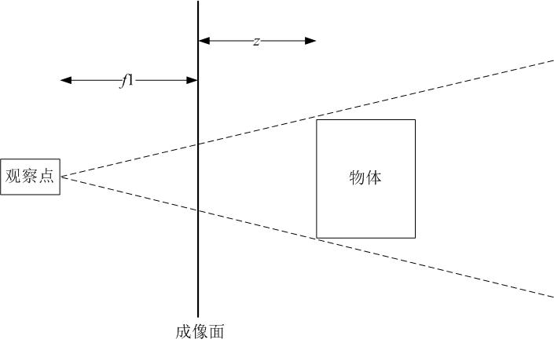

## z轴

&#160; &#160; &#160; &#160;首先，要确定z轴方向是向内还是向外

&#160; &#160; &#160; &#160;任意伸出一只手，把四指指向x轴正方向，然后把手指向y轴正向弯曲，大拇指的方向指向或离开你自己，大拇指指向的方向即为z轴在坐标系中的正方向。

&#160; &#160; &#160; &#160;所以，如果你伸出右手，伸向x轴正方向，然后把手指弯向地面(y轴正向)，拇指会指向面前方向--这也是右手坐标系的z轴正方向。

## 透视图

&#160; &#160; &#160; &#160;透视图用来确定物体是接近还是远离我们。

- 物体变小代表它远离
- 远离的物体会汇聚在一个消失点上

&#160; &#160; &#160; &#160;铁轨消失在地平线上，那个点就是消失点。所以，当在z轴上移动物体时，要做两件事。

- 放大或缩小物体
- 让他靠近或远离消失点

&#160; &#160; &#160; &#160;在二维系统中，可以使用屏幕的x,y坐标作为物体的x,y坐标，因为他们是一一对应的。但是在三维系统中不行，两个物体有相同的x,y坐标，但是由于深度不同，他们在屏幕上的位置就可能不一样。

## 透视图公式

&#160; &#160; &#160; &#160;**基本思想**：随着物体的原理(z坐标增加)，它的大小缩小到0，同时x,y坐标向消失点移动



&#160; &#160; &#160; &#160;有一个正在远离你的物体，一个观察点(摄像机)和一个成像面(我们观察物体的地方，即屏幕)。物体和成像面之间有一段距离，也就是 *z* 值。观察点到成像面也有一段距离，与照相机镜头的焦距类似，所以用变量 *f1* 表示。长焦距可以比作长焦镜头。短焦距是广角镜头，视野很大，但是有变形。中等焦距类似人的眼睛， *f1* 为 200~300 之间的值。下面是透视公式

```java
scale = f1 / (f1 + z);
```

&#160; &#160; &#160; &#160;公式通常会产生 0.0~1.0 之间的一个值，这就是你用来做缩放和靠近消失点的比例。但是随着 *z* 坐标越来越接近 *-f1* ， (*f1 +z*) 会趋近于0， *scale* 趋近无限大。就像贴着眼睛观察物体一样。

&#160; &#160; &#160; &#160;这个比例可以用来在绘制物体前调整canvas上下文中的缩放比例，以Ball类为例，可以在它的draw方法中使用scaleX和scaleY属性，像这样

```java
context.scale(this.scaleX, this.scaleY);
```

&#160; &#160; &#160; &#160;举个例子，使用250作为焦距。如果z是0，物体正好在成像面上。缩放比例应该是 250 /(250+0)即为 1.0，用1.0乘以物体的x,y坐标，不发生变换。

&#160; &#160; &#160; &#160;现在向外移动使z为250，缩放比例为250/(250+250)也就是scaleX和scaleY为0.5 。同时要移动物体在屏幕上的位置，如果之前物体在屏幕上的位置为 (200, 300)，现在的位置就应该是 (100, 150) ，也就是向消失点移动了一半(实际上，屏幕的位置也是相对于消失点的，移动相机的位置和移动消失点的位置实质是一样的)

&#160; &#160; &#160; &#160;把z向外移动让z等于9750，缩放比例为 250/(250+9750)也就是0.025，物体已经变成一个很接近消失点的小点

## 编写透视程序

### 运行效果

<iframe height="450px" width="450px" src="http://aicdg.com/html5-animation/html5-animation/examples/ch15/01-perspective-1.html" frameborder="0"></iframe>

### 具体代码

```html
<!doctype html>
<html>
  <head>
    <meta charset="utf-8">
    <title>Perspective 1</title>
    <link rel="stylesheet" href="../include/style.css">
  </head>
  <body>
 
    <canvas id="canvas" width="400" height="400"></canvas>
    <aside>Mouse moves circle on x and y axis, up/down key along the z-axis.</aside>

    <script src="../include/utils.js"></script>
    <script src="./classes/ball.js"></script>
    <script>
    window.onload = function () {
      var canvas = document.getElementById('canvas'),
          context = canvas.getContext('2d'),
          mouse = utils.captureMouse(canvas),
          ball = new Ball(),
          xpos = 0,
          ypos = 0,
          zpos = 0,
          fl = 250,
          vpX = canvas.width / 2,
          vpY = canvas.height / 2;

      window.addEventListener('keydown', function (event) {
        if (event.keyCode === 38) {         //up
          zpos += 5;
        } else if (event.keyCode === 40) {  //down
          zpos -= 5;
        }
      }, false);

      (function drawFrame () {
        window.requestAnimationFrame(drawFrame, canvas);
        context.clearRect(0, 0, canvas.width, canvas.height);
        
        var scale = fl / (fl + zpos);
        xpos = mouse.x - vpX;
        ypos = mouse.y - vpY;
        ball.scaleX = ball.scaleY = scale;
        ball.x = vpX + xpos * scale;
        ball.y = vpY + ypos * scale;
        
        ball.draw(context);
      }());
    };
    </script>
  </body>
</html>

```

{{site.data.alerts.warning}}创建变量xpos、ypos和zpos，还有f1 。创建一个消失点 (vpX, vpY)。随着物体原理，坐标会逐渐趋近 (0, 0)，如果不进行偏移，会向屏幕左上角汇聚，这并不是想要的{{site.data.alerts.end}}

&#160; &#160; &#160; &#160;运行本例时，一开始看起来是鼠标在拖动小球，因为zpos为0，scale为1.0，所以没有透视效果。当按向上的方向键时，小球好像在变小，现在移动鼠标，小球随之移动，但是范围会变小，产生视差效果。

{{site.data.alerts.important}}理论上，当zpos等于 *-f1* 时，公式 scale =  f1 / (f1 + zpos)变成了 scale = f1/0 。在很多语言里，除以0会导致错误，但是在JavaScript中会得到 Infinity。随着zpos的减小，f1除以一个复数，会导致坐标系翻转。{{site.data.alerts.end}}

&#160; &#160; &#160; &#160;解决这个位图有个很简单的方法，当小球越过某个点时让它消失。如果zpos小于等于 *-f1* 就会出现问题，所以可以检测这个点。下面是修改过的drawFrame函数

```javascript
(function drawFrame () {
	window.requestAnimationFrame(drawFrame, canvas);
    context.clearRect(0, 0, canvas.width, canvas.height);
    
    if (zpos > -f1) {
    	var scale = fl / (fl + zpos);
    	xpos = mouse.x - vpX;
    	ypos = mouse.y - vpY;
    	ball.scaleX = ball.scaleY = scale;
    	ball.x = vpX + xpos * scale;
    	ball.y = vpY + ypos * scale;
    	ball.visible = true;
    } else {
    	ball.visible = false;
    }    
    
    if (ball.visible) {
    	ball.draw(context);
    }    
}());
```